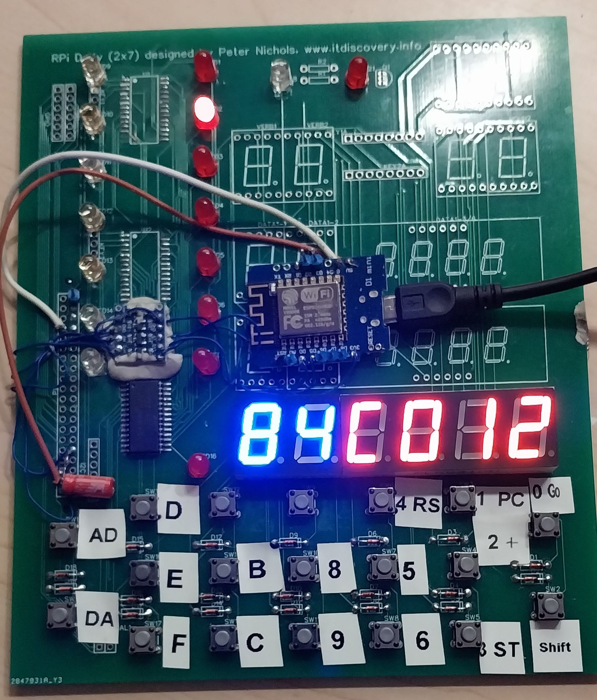

# ANNE-1 Emulator (ESP8266 Edition)

**Platform:** ESP8266 (NodeMCU / Wemos D1 Mini)  
**Core:** Motorola 6809 CPU Emulation

## 1. Overview
The ANNE-1 is a custom 8-bit computer architecture emulated on the ESP8266. It runs a modified version of **Microsoft Extended Color BASIC** and a custom **System Monitor**. The system features dual-mode operation: it can be controlled via a serial terminal (TTY) or a **TM1638** LED & Keypad module (simulating a front panel).

## 2. System Architecture
* **CPU:** Emulated 6809 (Generated via Google Gemini over several weeks and tested against a known test suite).
* **RAM:** 16KB User RAM (`$0000` - `$3FFF`).
* **ROM:**
    * **BASIC:** 12KB (`$C000` - `$EFFF`) - Microsoft Extended BASIC (Derived from Grant Searle's version).
    * **Monitor:** 4KB (`$F000` - `$FFFF`) - Custom "ANNE-1 Mon V13".
* **I/O:** Memory-mapped I/O located at `$FF00` - `$FF69`.

## 3. Memory Map & I/O Registers
The ANNE-1 uses a strict memory map enforced by the Hardware Abstraction Layer (`ANNEHal.cpp`).

| Address Range | Description | Function |
| :--- | :--- | :--- |
| **$0000 - $3FFF** | **User RAM** | 16KB Program & Variable Space. |
| **$4000 - $BFFF** | *Unused* | Reserved / Empty. |
| **$C000 - $EFFF** | **BASIC ROM** | 12KB Extended BASIC interpreter. |
| **$F000 - $FFFF** | **Monitor ROM** | 4KB System Monitor & Vector Table. |

### I/O Register Map ($FFxx)

| Address | R/W | Description |
| :--- | :--- | :--- |
| **$FF00** | R | **Keypad Input:** Returns ASCII of last TM1638 key press. |
| **$FF20** | W | **Display High:** Writes to upper 2 digits of TM1638. |
| **$FF21** | W | **Display Low:** Writes to middle 2 digits of TM1638. |
| **$FF22** | W | **Display Data:** Writes to lower 2 digits of TM1638. |
| **$FF23** | W | **LED Control:** 8-bit register mapping to TM1638 LEDs 0-7. |
| **$FF24** | W | **GPIO Output:** Bit 0 maps to **Pin D6 (GPIO12)**. |
| **$FF25** | R | **ADC Input:** Reads **Pin A0**, scaled to 8-bit (0-255). |
| **$FF68** | R | **ACIA Status:** Bit 0=Rx Ready, Bit 1=Tx Ready. |
| **$FF69** | R/W | **ACIA Data:** Serial I/O (Console). Auto-maps DEL(7F) to BS(08). |

## 4. Hardware Connections (ESP8266)

| ESP Pin | GPIO | Component | Function |
| :--- | :--- | :--- | :--- |
| **D0** | 16 | TM1638 | STB1 (Strobe) |
| **D1** | 5 | TM1638 | DIO (Data) |
| **D2** | 4 | Button | Reset (Active Low) |
| **D3** | 0 | Button | NMI / Stop (Active Low) |
| **D5** | 14 | TM1638 | CLK (Clock) |
| **D6** | 12 | External | Tape/GPIO Out (`$FF24`) |
| **D7** | 13 | Jumper | Mode Select (GND = TTY) |
| **A0** | ADC0 | External | Tape/Sensor In (`$FF25`) |

## 6. Building the Project

### Hardware
An ESP-8266 runs this platform just faster than a real 6809. A TM1638 Board/Module is also needed, I used my DSKY project, and have
included (at the time of this writing) an untested PCB. There are also lots of TM1638 boards out there, just don't forget to ensure 
to either add a 3.3V to 5V transciever or add one. Writing to the display will work without the transciver, but reading keys will not. 
You would also need to mod the board to add additional keys.

![TM1638 with 16 keys][tm1638-all.jpg]
![TM1638 with 8 keys][tm1638-full.jpg]

### Software
The toolchain uses Python scripts to assemble the 6809 source code into C-compatible header files for the Arduino IDE.

1.  **Monitor:** `python build_monitor.py` -> Generates `ANNE_ROM.h`
2.  **BASIC:** `python build_basic.py` -> Generates `BASIC_ROM.h`
3.  **Compile:** Open `ANNE1onESP8266.ino` in Arduino IDE and upload to ESP8266.

## 7. Usage
### Serial Mode
* Set Jumper **D7** to GND.
* Connect via Serial Terminal (115200 Baud, 8N1).
* Press **Reset**. You will see the BASIC banner.

### Keypad Mode (Monitor)
* Remove Jumper **D7**.
* Press **Reset**. The TM1638 display will show the current address/data.
* **Keys:**
    * `0-F`: Enter Hex Digits.
    * `a`: Address Mode (Set Address).
    * `d`: Data Mode (Modify Data at Address).
    * `+`: Increment Address.
    * `GO`: Execute from current address.
